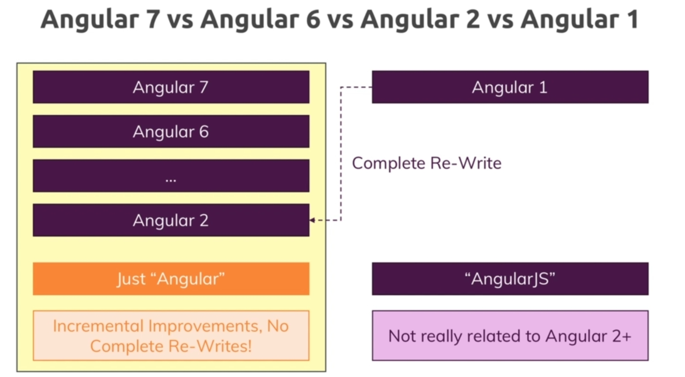
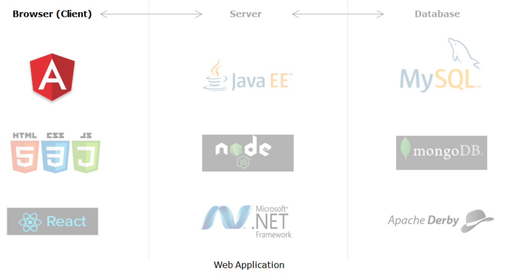

## Course roadmap

---
## A. SPA 
- single page application.
- DOM manipulation dynamically - change detection, virtual DOM, etc
- inspired from android and ios app.
- **traditional web applications** issues
  - Users face issues like slow responses, 
  - more waiting time 
  - multiple call and refersh in browser.
- SPA are good for developing **responsive websites**
  - Does not make regular communication with Server.
  - No page refresh / no URL change (route chnages).
  - centralized store with redux to cache response
---
## B. angular vs AngularJS


---
## C. Angular 2+
- JS framework from Google to develop SPA for both both mobile and desktop.
- Angular1 or `angularJs` (2010) 
- Angular2+ or `angular` (2016) >  incremental improvements... >  Angular20 (2025)
- uses TS
- Other UI frameworks: AMBER, BackBONE, **REACT JS** , **Vue**, etc.
- segregate - style (css), view(html), data-logic(JS/TS)
- **Component based approach** - Breaks pages into multiple component

## D. Develops things
- [Hero of heros Tutorial](https://angular.io/tutorial)
- https://angular.dev/playground
### 1. angular project things
  1. Create a **component** 
  2. Enhance the functionality of components using Angular **directives**
  3. Create Angular **forms** and bind them with model data using data binding 
     - Validate forms using Angular built-in or custom **validators**
  5. Format the rendered data using Angular built-in or custom **pipes**
  6. **components interaction** - Input and Output decorators
  7. Communicate with remote server - Angular **HttpClient** class with RxJS Observables
  8. Add synchronous or asynchronous Angular **routing**
  9. Angular material Add other features - pagination, progress bar, table etc.
  10. central store : **redux**
  11. reactive : **rxJs or signal**
  12. PWA 
  13. makes backend api to load data
  


### 2. creat ng project
- Install node js and npm 
  - ng -v 
  - npm -v 
  - **ng <cli commands>** | eg: ng g c | ng g d | ng build | ng server | etc
- Create project-1 folder and 
- terminal and go to project-1
- **npm i angular/cli**
- check :: tsconfig.json, package.json, angular.json
- ng:
  1. `ng new` <proj1>
  2. Check `pkg.json` : It define all the dependencies for node-module folder.
  3. check `tsconfig.json`
  4. `ng build`
  5. `ng serve` : It will bootstrap root module. ng serve --open --port 3000
  6. `ng generate component` or `ng g c `
  7. `ng generate service` or `n g s`
  8. `ng generate directive` or `ng g d`


---
### 3.bootstrap appModule > app-component

- ng CLI creates a root component in root module
  - app.component.ts
- check 
  - **src/index.html** (single page) 
  - **src/main.tss**
```
<body>
    <root-app> </root-app>
</body>
```

```
import { enableProdMode } from '@angular/core';
import { platformBrowserDynamic } from '@angular/platform-browser-dynamic';
import { AppModule } from './app/app.module';
import { environment } from './environments/environment';

if (environment.production) {
  enableProdMode();
}

platformBrowserDynamic().bootstrapModule(AppModule)
  .catch(err => console.log(err));

```


