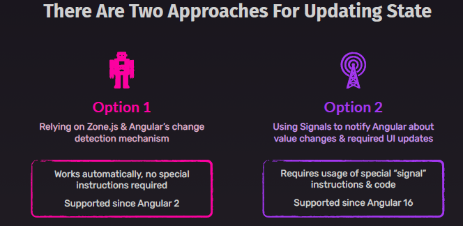
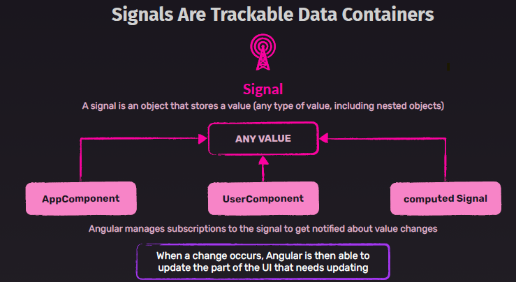

# ng16
## 1 Signals (stable in ng17)
**option-1** : `chnage dectection mechanism + zone.js`
  - updating value of any property in any component 
    - change is automatically detected
    - passed to template/view
    - note: zone.js notifies about user event, expired times, async task result, etc
**option-2** : `signal`
    - inspired from Ngrx, so should be easy
    - better performance
    - signal1 = signal({ k1:v1, k2:v2})
    - subscribe on : :point_left:
      - template: {{ **signal1()**.k1 }}
      - ts : **computed**( () => **signal1()**.k1 ) // just warpping inside computed, which **also return signal**
        - signal2 = **computed**( () => **signal1()**.k1 )
    - so now component does not check **every possible event** for any update to receive.
    - not using Subject, EventEmitter, app is pure **zoneless**, then can remove zone.ts from build. (future) :point_left: :point_left:
  

