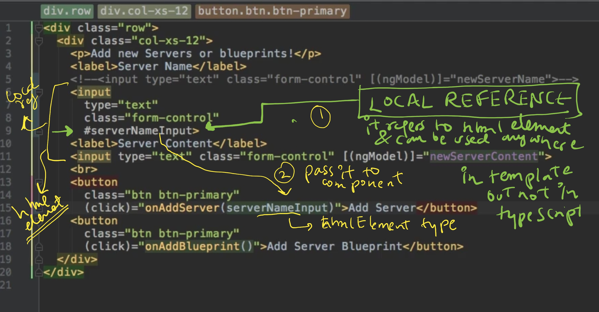
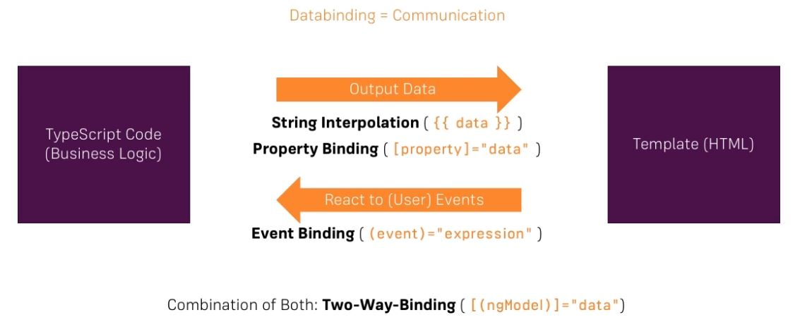

## A. Architecture
### 1. Change detection.
- https://chat.deepseek.com/a/chat/s/f3b93971-68b6-4204-b9c1-7380c3164ffd
  - changeDetection: ChangeDetectionStrategy.OnPush /Default
  - constructor(private cd: ChangeDetectorRef)
  - **TrackBy Function** | <div *ngFor="let item of items; trackBy: trackById">
---

## B. Developer
### 1. NgModules
- it provides context for components
- An Angular app is defined by a set of NgModules 
  - one **root module** (which provides the **bootstrap** mechanism that launches the application) 
  - many feature modules.
- **benefits**
  - **Organizing** complex applications into distinct functional modules 
    - helps in managing development, designing, re-usability, scalibity, etc
  - Also **lazy-loading** of module. :pont_left:
  - **import/export**
    - NgModules can **import** functionality from other NgModules
    - and allow their own functionality to be **exported** and used by other NgModules
- root module (bootstrap, special module)
- Could lazily load feature modules via ng routing
  - it will load registered comp + child comp
  
### 2. Components\
```txt
@Component({
  selector: 'app-signin',
  templateUrl: './signin.component.html',
  styleUrls: ['./signin.component.css']
})

selector: 'app-signin'    |   <div app-signin> </div>
selector: '[app-signin]'  |   <div app-signin> </div>
selector: '.app-signin'   |   <div class="app-signin"> </div>
```
- **purpose**: moudule design, resuabilty, etc
- Each component defines:
#### @Component class component-1 
- has application data and logic
- constructor()
  - **@Injectable** service-1 : to load backend data
    - service-1
    - service-2
    - ...
    
#### template / templateUrl 
- HTML,that defines a view. has: 
  - html5-tags
  - ng-component-selector
  - ng-directive-selector
  - ng-pipe
  - ...
- inline: `template` or  external: `templateUrl`
- **Template Expressions** --> The text inside {{ }} 
- **Template Statement** --> (event) = statement
- **local reference** :point_left:
  - Inside html, Create references on any html-element / component. eg `#ref1`
  - ref1 can be used anywhere in template.
  - **pass reference**
    - way-1: pass as JS-object, **HTMLElement**. m1(ref1: HTMLInputElement) 
    - way-2: **@viewChild / @viewContent** :point_left:
  

  
#### `styleUrls` 
- many css files
- npm install bootstrap@3y
  - go tp angular.json > add : "style": [ "node_module/bootstrap/dist/css/bootstrap.min.css" **, "src/styles.css"]
  - global styling - ../src/styles.css
  
### more
- `providers` - optional, to inject Services to component and to its child component.
- `animation` - optional.
- `selector` : custom tag for component
- `encapsulation` : 
  - **native** : same as Emulated, but won't work in older browser
  - **None** : 
    - ng will not unique property/attribute
    - hence parent component style will be applied.
  - **Emulated** :point_left: 
    - ng adds unique property in every element. eg : ng-content-ego-2
    - then later it is used by css property selector to apply style.
---  
### 3. Directives
- directives provide program logic

---
### 4. Binding/s
- https://chat.deepseek.com/a/chat/s/6cbd1509-8d5d-4564-93e2-5017ffe902b9
- 
#### 4.1 String Interpolation - {{ }} 
```html
<p>{{ title }}</p>
<p>1 + 1 = {{ 1 + 1 }}</p>
<p>Hello, {{ getUserName() }}</p>
---
{{fn(msg)}}
Anything which get converted into string is ok.
---
<p> {{ var1 }} </p>  | <p [innerText]=var1 > </p>  // trick-1 : both are same
```

#### 4.2 Event binding (View to Component)
- html event, custom ng event (EventEmitter<T>, Subject<T>**) :point_left:
- <input (keyup)="onKeyUp($event)">
- bind data from **template** (event data,etc) to **component**(TS property, say var-1)
  - text entered into input
  - button clicked
  - ....
```html
<button (click)="onButtonClick()">Click me</button>
<input (keyup)="onKeyUp($event)"> 
```
- `$event` is reserved keyword to capture the event data.
- **(<HTMLInputElement>e.target).value**

- **Scenarios**
  - scenario-1 ; parent -child comm
    - component-1 
      - child component-1 (EventEmitter-1, subject-1)
  - scenario-1 ; sibling comp comm
    - service-1 (EventEmitter-1, subject-1), inject to both comp:
    - comp-1
    - comp-2
    
#### 4.3 Property binding (Component to View)
- property binding --> attribute html tag, property of ng comp and ng directive :point_left:
  - [property]="var-1"
  - [property]="'string-value'" ===  property="string-value"
  - <comp1 [ng-directive1]=value>
  - <comp1 [attr1]=value>
```html

<button [disabled]="isDisabled">Click me</button>
<div [class.active]="isActive"></div>
<div [style.color]="textColor"></div>
```
```html
--- view ---
<button [disabled]="'true'"> </button>
<button [disabled]="'false'"> </button>

<button [disabled]="newValue"> </button>

 --- component ---
boolean newValue = true;
setTimeOut( () => newvalue != newvalue, 5000); //after 5 sec toggle.
```

#### 4.4 two-way data binding
```html
<input [(ngModel)]="userName">
<!-- Equivalent to: -->
<input [ngModel]="userName" (ngModelChange)="userName = $event">
//remember to import **FormsModule** in your app module for **ngModel**
```
- **custom-1**
  - create var var1
  - create m1(event){...}
  - in html : [attribute-1]=var1
  - in html : (click) = m1($event)
- **custom-2**
```html
@Input() value: any;
@Output() valueChange = new EventEmitter<any>();

<app-custom [(value)]="someValue"></app-custom>
```
#### 4.5 more
```html

=== Attribute Binding ===
<button [attr.aria-label]="closeLabel">X</button>
<td [attr.colspan]="colSpan"></td>

=== Class Binding ===
<div [class.special]="isSpecial"></div>
<div [class]="classExpression"></div> <!-- replaces all classes -->

=== Style Binding ===
<button [style.color]="isSpecial ? 'red' : 'green'">Button</button>
<div [style.width.px]="widthValue"></div>

=== special binding ===

  === *ngFor (Structural directive) ===

  <ul>
    <li *ngFor="let item of items; let i = index">
      {{ i }} - {{ item.name }}
    </li>
  </ul>

  === *ngIf (Structural directive) ===

  <div *ngIf="showElement; else otherTemplate">
    Content to show when condition is true
  </div>
  <ng-template #otherTemplate>
    Alternative content
  </ng-template>

  === ngSwitch ===

  <div [ngSwitch]="value">
    <p *ngSwitchCase="'A'">Value is A</p>
    <p *ngSwitchCase="'B'">Value is B</p>
    <p *ngSwitchDefault>Value is something else</p>
  </div>
```

---
### 5. Pipes
- transforming values, eg; dates and currency
- Angular provides predefined pipes for common transformations,
- define custom pipes.

---
### 6. Services
- **Purpose** 
  - Act as end point to interact with backend/server
  - Components interaction.
- Class with decorator @Injectable() 
- **injection**
  - Declare services in **NgModule provider** section. 
    - registers service with NgModule
    - Add it in **export** section to make services avialable to other module.
    - module is loaded, loads  registered services along with it, **lazily**.
- **register**
  - Declare services in **Component provider** section.
    - it will inject the service into component
    - and its child comp.
    - so, if we define Service at app Module, it will avilable to all inner module of app, no import is required.
```txt
- ng g s Myservice1
- ng generate service Myservice1
```
---
### 7. Routes 
- **Router service**  helps in define navigation paths among Angular-views (template + Component)
- It maps URL-paths to Angular-views, instead of traditional JSP pages.
- Follows browser convention : URL in the address bar, Click links and browser's back &forward buttons.
- Apart from that we can navigate to new views when the user clicks a button or selects from a drop box.
- router can lazy-load the **module**
- router logs activity in the browser's history
- The router interprets a link URL according to your app's view **navigation rules and data state.** and shows or hides view hierarchies.

---
### 8. Forms
- Declarative
- Reactive

---
### 9. testing : 
- jasmine 
- Karma
___
### 10. lib
- **Rxjs** : Observables
  - Angular itself used it alot.
  - Alternative for promise.
  - new : `signal`
- **HttpClient**
  - New: `HttpClientModule` (added in ng6)
- **NgRx** 
  - State management in Angular


