# Directives
- **ng generate directive highlight**
## 1 Intro
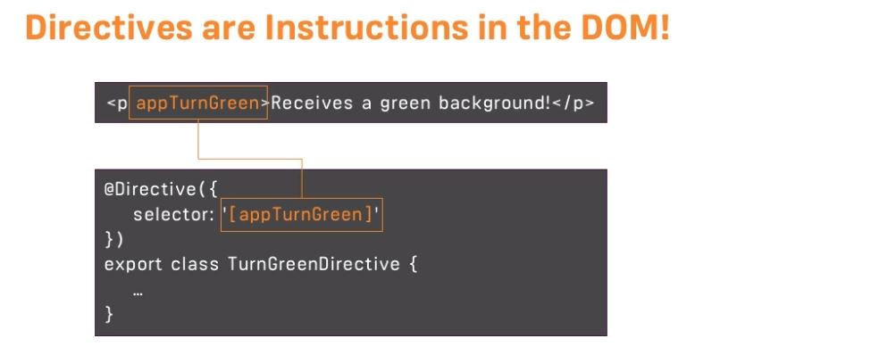
- Directives are classes that add additional **behavior** to elements in your Angular applications
- like ng component, but  **without view**
- helps in manipulate the DOM, modify element appearance, or change behavior.
- **selector**: attribute style
- host element
- creates reusable behaviors and extend HTML's capabilities.

## 2 Types
### 2.1 structural directive
- which add/remove host elment from DOM
- cant apply 2 structural direective on same element. eg: display odd number:
- starts with *  
- * has special meaning and it get replaced with actual code. eg:
```html
< comp1 *ngIf="var1"> </comp1>`

--replacement code ---
 <ng-template [ngIf]="var1"> 
   <div>
     <comp1> </comp>
   </div>
 </ng-template>
```
#### `*ngIf`
```html
  <div *ngIf="showElement; else otherTemplate">
    Content to show when condition is true
  </div>
  <ng-template #otherTemplate>
    Alternative content
  </ng-template>
```
- note: `<ng-template>  </ng-template>` is also directive. :point_left:
- otherTemplate - local reference
- 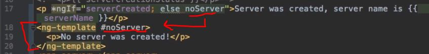
- Another tricky way : use ngIf twice with reverse conditions :)

#### `*ngFor` 
```html
 <ul>
  <li *ngFor="let item of items; let i = index">
    {{ i }} - {{ item.name }}
  </li>
</ul>
```
#### `*ngCase` +  `[ngSwitch]`
```html
  <div [ngSwitch]="value">
    <p *ngSwitchCase="'A'">Value is A</p>
    <p *ngSwitchCase="'B'">Value is B</p>
    <p *ngSwitchDefault>Value is something else</p>
  </div>
```
#### Custom Structural directive
```typescript
@Directive({
  selector: '[appUnless]'
})
export class UnlessDirective {
  private hasView = false;

  constructor(
    private templateRef: TemplateRef<any>,
    private viewContainer: ViewContainerRef
  ) {}

  @Input() set appUnless(condition: boolean) {
    if (!condition && !this.hasView) {
      this.viewContainer.createEmbeddedView(this.templateRef);
      this.hasView = true;
    } else if (condition && this.hasView) {
      this.viewContainer.clear();
      this.hasView = false;
    }
  }
}
---
<p *appUnless="condition">Show this unless condition is true</p>
```

---
### 2.2 Attribute directives
- custom attribute
- apply on host element
- **property binding** to assign dynamic value
- [directive-1]="var1"

#### `ngStyle`  : dynamic styling
```html
obj1 =  { backgroundColor: red}      // camelCase format
obj2 =  {`background-color`: blue}   // css format

=== static ===
<p [ngStyle]="obj1"> {{status}}</p>
<p [ngStyle]="obj2"> {{status}}</p>

=== dynamic ===
<p [ngStyle]="{ backgroundColor: getColour() }"> {{ status }}</p>
getColour = () =>  this.status == 'online' ? 'green' : 'red';  // in TS file
```

#### `ngClass` : add/remove classes dynamically
```html
obj1 =  { `class-1`: true}
obj2 =  { `class-1`: false}

=== static ===
<p [ngClass]="obj1"> {{status}}</p>
<p [ngClass]="obj2"> {{status}}</p>

=== dynamic ===
<p [ngClass]="{ `class-1`: getClass()}"> {{ status }}</p>
getClass = () =>  this.status == 'online' ? { `class-1`: true} : { class2: false} ;  
```
#### `ngModel` : two-way data binding

#### Custom Attribute directive
- inject ElementRef (host element)
```typescript
@Directive({
  selector: '[appBorder]'
})
export class BorderDirective {
  @Input() appBorder: string;
  
  @Input() borderWidth: string = '1px';

  constructor(private el: ElementRef) {
    el.nativeElement.style.border = `${this.borderWidth} solid ${this.appBorder}`;
  }
}

---

<div [appBorder]="'red'" [borderWidth]="'2px'">Content</div>
```
---

## 3. Life Cycle
```typescript
@Directive({...})
export class MyDirective implements OnInit, OnDestroy {
  ngOnInit() {
    // Initialization logic
  }
  
  ngOnDestroy() {
    // Cleanup logic
  }
}
```
---

## 4. @HostListener / @HostBinding
- `@HostListener` - Listens to host element events.
- `@HostBinding` - Binds to host element properties.
  - @HostBinding( `any property of host Element' )

```typescript

@Directive({  selector: '[appHover]' })
export class HoverDirective 
{
  @HostBinding('class.hovered') isHovered = false;

  @HostListener('mouseenter') onMouseEnter() {
    this.isHovered = true;
  }

  @HostListener('mouseleave') onMouseLeave() {
    this.isHovered = false;
  }
  
  constructor(private el: ElementRef) { }
}
```
---
## 4. directive : `ng-template` 
- this is inject template from parent component to child component.
- `template (inside innerText of P-comp1)` > inject > `ng-template tag inside template C-comp1 will get replaced`

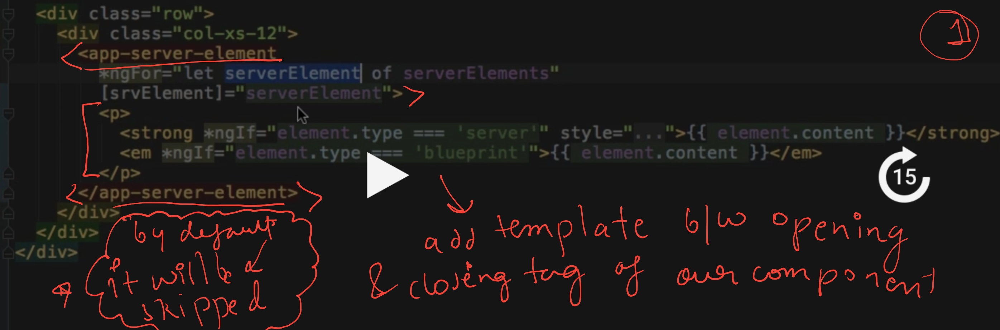
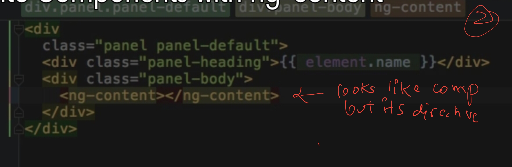

- Above point 3.2 > @viewContent > it will get reference defined on template which is injected by parent component.
  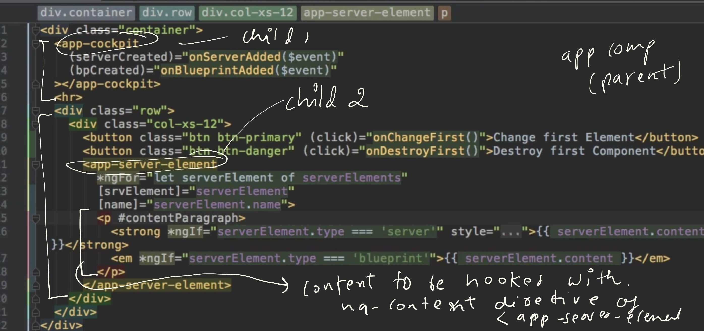
  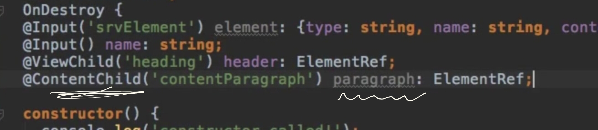
---
## 5. directive : `ng-content` 
- in progress

---
## 6. program example/s
- example-1: even/odd number list with different styling - ngClass and ngStyle.


---
## 99. OLD screenshots
---
- **Renderer2** better https://angular.io/api/core/Renderer2#methods

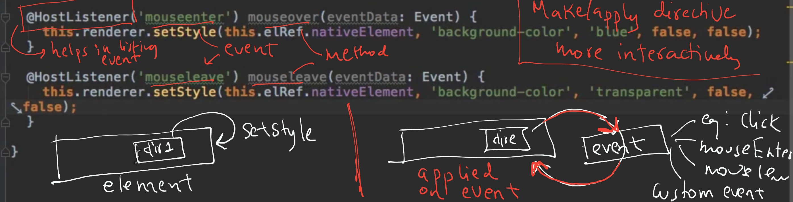

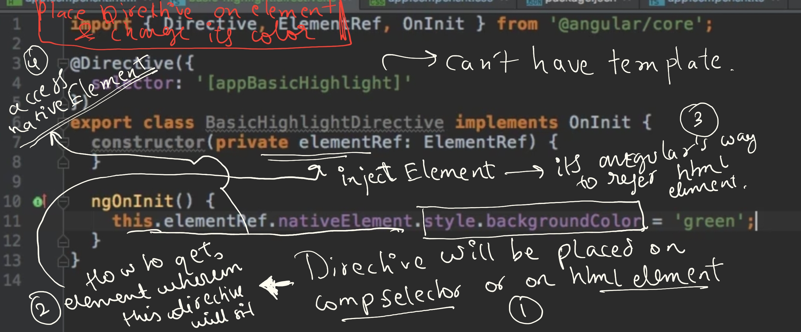

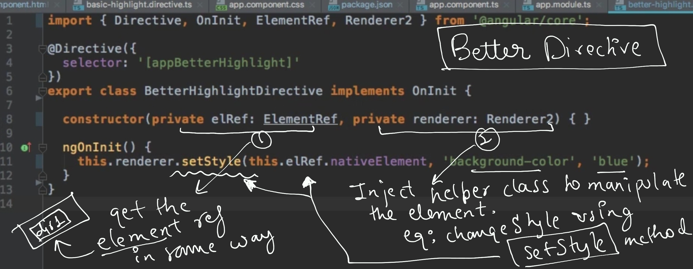

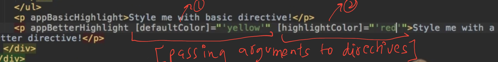

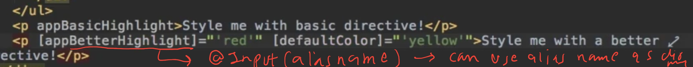

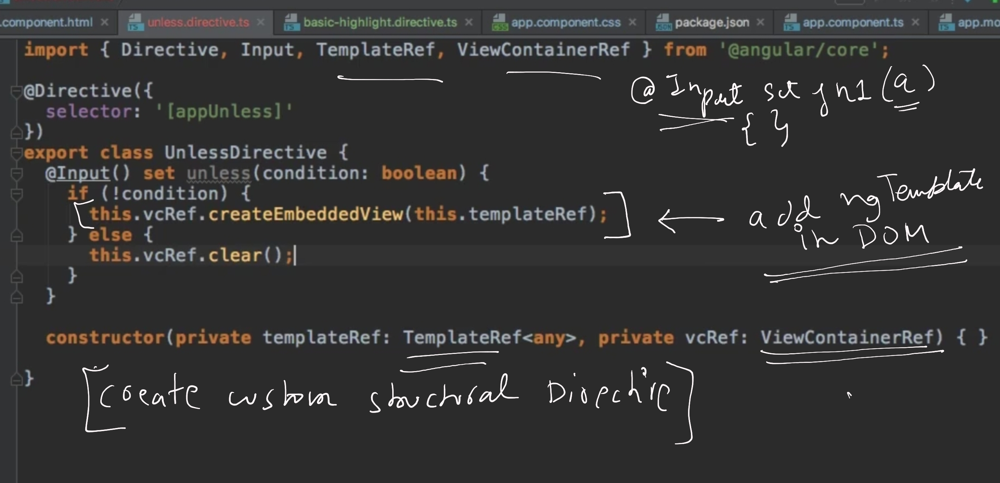


