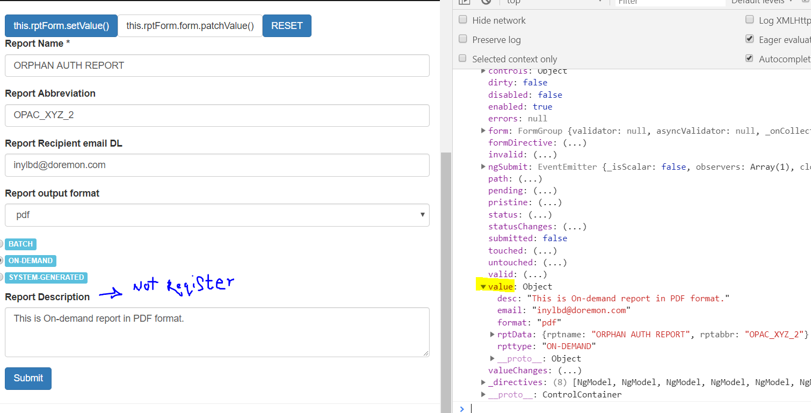
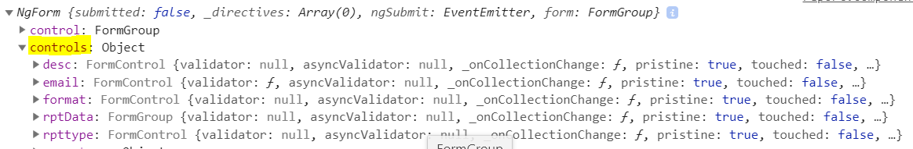

# Angular Forms: 

### A. intro
- form - data-entry experience
- two-way data binding, change tracking, validation, and error handling.
- Angular gives JS representation of Form-Object
  - with **form-data** in K,V format  
  - other **metadata** 
    - for validation
    - for add styling
## B. Type:
### 1. TD : Create and manage form 
- Angular infers the form-object from DOM
- Thumb rule : Do everything  in Template only.
- import **FormModule**
  - it will detect the `<form>` 
  - create JS-rep of form automatically. 
  - register form to **ngForm** directive :point_left:
  - register controls using **ngModel** directive :point_left:
  - Get access to JS-rep using below steps.
    - **@viewChild('formRef') form : NgForm**
```html
  <form (ngSubmit) = "f1(formRef) #formRef="ngForm"> 
    <!-- automatically create FormControl instances -->
    <input name="key1" [(ngModel)]="feild1" ngNativeValidate> 

    <input name="key2" #feild2="ngModel" >
    <span class="error-style-1" *ngIf="!feild2.valid && feild2.touched">Please enter a valid email!</span>  

    <button type=submit > sunmit </button>
  </form> 
  <!--Since SPA  - Dont add - action (GET,POST,etc)-->
  
``` 
```typescript
  f1(formRef : ElementRef) => { 
    console.log(formRef)
  }
```
```css
error-style-1 {
  border: 1px solid red;
}
```

**formRef**


**FormControl**


---
### 2. Form validation
- ng - **Validators** class: https://angular.dev/api/forms/Validators
- HTML5 -  validation ?
```typescript
class Validators {
  static min(min: number): ValidatorFn;
  static max(max: number): ValidatorFn;
  static required(control: AbstractControl<any, any>): ValidationErrors | null;
  static requiredTrue(control: AbstractControl<any, any>): ValidationErrors | null;
  static email(control: AbstractControl<any, any>): ValidationErrors | null;
  static minLength(minLength: number): ValidatorFn;
  static maxLength(maxLength: number): ValidatorFn;
  static pattern(pattern: string | RegExp): ValidatorFn;
  static nullValidator(control: AbstractControl<any, any>): ValidationErrors | null;
  static compose(validators: null): null;
  static compose(validators: (ValidatorFn | null | undefined)[]): ValidatorFn | null;
  static composeAsync(validators: (AsyncValidatorFn | null)[]): AsyncValidatorFn | null;
}
```

- Angular maintains the **state** and 
  - form  : valid, dirty, touched, etc
  - formControl level. valid, dirty, touched, etc
- also add css classes


### 3. Group Form Control

Template:


Output:


### 4. Use report data
eg : this.rptForm.value.rptData.rptname;

### 5. Setting, patch and reset
@ViewChild('f') rptForm: NgForm;

eg:


