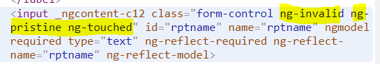

# Angular Forms: 

### A. intro
- form - data-entry experience
- two-way data binding, change tracking, validation, and error handling.
- Angular gives JS representation of Form-Object
  - with **form-data** in K,V format  
  - other **metadata** 
    - for validation
    - for add styling
## B. Type:
### 1. Template driven
- Angular infers the form-object from DOM
- Thumb rule : Do everything  in Template only.
- import **FormModule**
  - it will detect the `<form>` 
  - create JS-rep of form automatically. 
  - register **form** to **ngForm** directive :point_left:
  - register **controls** using **ngModel** directive :point_left:
    - FormGroup-1
      - control-1
      - control-2
      - ...
    - FormGroup-2
      - ...
  - Get access to JS-rep using below steps.
    - **@viewChild('formRef') form1 : NgForm**
      - form1.path( { })
      - form1.patch( { })
      - form1.reset()
```html
  <form (ngSubmit) = "f1(formRef) #formRef="ngForm"> 
    <!-- automatically create FormControl instances -->
    <div id="group-key-1" #group1Ref= ngModelgroup [(ngModelgroup)]="group-1-data">
      <input name="key1" [(ngModel)]="feild1" ngNativeValidate>
    </div>

    <div id="group-key-1" #group1Ref= ngModelgroup [(ngModelgroup)]="group-1-data">
      <input name="key2" #feild2="ngModel" [(ngModel)]="feild2">
      <span class="error-style-1" *ngIf="!feild2.valid && feild2.touched">Please enter a valid email!</span>
    </div>

    <button type=submit > sunmit </button>
  </form> 
  <!--Since SPA  - Dont add - action (GET,POST,etc)-->
  
``` 
```typescript
  f1(formRef : ElementRef) => { 
    console.log(formRef)
  }
```
```css
error-style-1 {
  border: 1px solid red;
}
```

**formRef**


**FormControl**


---
### 2. Form validation
- ng - **Validators** class: https://angular.dev/api/forms/Validators
- HTML5 -  validation ?
```typescript
class Validators {
  static min(min: number): ValidatorFn;
  static max(max: number): ValidatorFn;
  static required(control: AbstractControl<any, any>): ValidationErrors | null;
  static requiredTrue(control: AbstractControl<any, any>): ValidationErrors | null;
  static email(control: AbstractControl<any, any>): ValidationErrors | null;
  static minLength(minLength: number): ValidatorFn;
  static maxLength(maxLength: number): ValidatorFn;
  static pattern(pattern: string | RegExp): ValidatorFn;
  static nullValidator(control: AbstractControl<any, any>): ValidationErrors | null;
  static compose(validators: null): null;
  static compose(validators: (ValidatorFn | null | undefined)[]): ValidatorFn | null;
  static composeAsync(validators: (AsyncValidatorFn | null)[]): AsyncValidatorFn | null;
}
```

- Angular maintains the **state**  
  - form  : valid, dirty, touched, etc
  - formControl level. valid, dirty, touched, etc
- also add css classes




---

### 2. reactive form
- Programmatically create form object , then sync it with DOM
- Complex approach but gives advance control to dev


