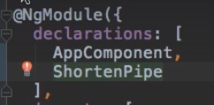
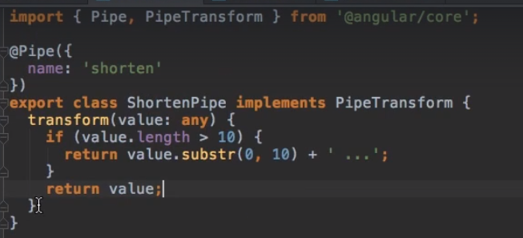
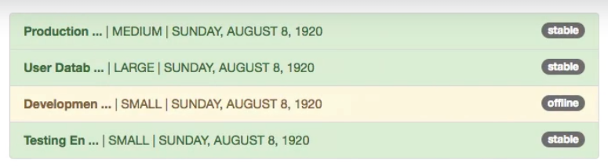
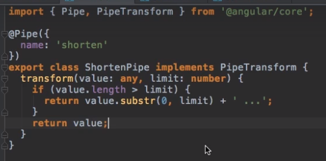

# Angular Pipes
## 1. Intro
- transforms the data (**sync/Async**)
- Use it at template/view, like directive.
- **ng g p pipe1**
- **{{ var1 | pipe1 : 'pipe-arg-1' : 'pipe-arg-2' : ... | pipe2  }}**
  - takes input as well
  - can be chained, order is matter

## 2 Examples
### 2.1built-in 
- https://angular.dev/api?query=pipe&type=pipe

### 2.2 Custom
- Can be chained with inbuilt pipes as well

#### Shorten text if lenght is  ore than 10 char.
- before : 
  - 
- Add pipe in declaration : 
  - 
- Add Pipe class : 
  - 
- After applying : 
  - 
- Add arg in pipe.
  - 

